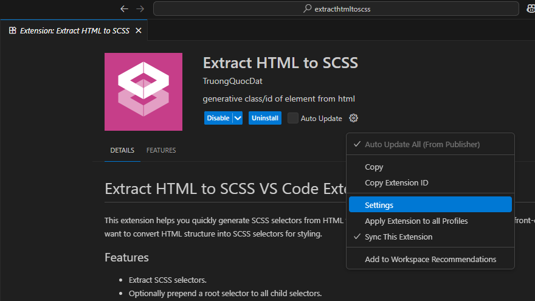

# Extract HTML to SCSS VS Code Extension

This extension helps you quickly generate SCSS selectors from HTML files in your workspace. It is especially useful for front-end developers who want to convert HTML structure into SCSS selectors for styling.

## Features
- Extract SCSS selectors.
- Optionally prepend a root selector to all child selectors.
- Ignores specified classes.
- Works with any HTML file in your workspace.
- Inserts generated SCSS directly into your active editor.

## How to Use
1. **Open your target SCSS file**
   - Make sure you have a SCSS or SASS file open in the editor where you want to insert the generated code.
2. **Run the command**
   - Press `Ctrl+Shift+P` (or `Cmd+Shift+P` on Mac) to open the Command Palette.
   - Search for and select `Extract HTML to SCSS`.


3. **Choose the HTML source file**
   - A quick pick menu will appear. Select the HTML file you want to extract selectors from.
4. **Enter the root selector**
   - Input the CSS selector for the root element (e.g., `.container .card`).
5. **View the result**
   - The extension will parse the HTML, generate selectors, and insert them at your cursor position in the active SCSS file.

## Example
Suppose your HTML contains:
```html
<div class="container">
  <div class="card">
    <h3>Title</h3>
    <div class="desc">Description</div>
  </div>
</div>
```
If you enter `.container .card` as the root selector, the extension will generate:
```css
.container .card { 
  h3 {}
  .desc {}
}

```

## Configuration
- **Ignore Classes:** You can customize the ignore list in the source code (`IGNORE_CLASS_PATTERNS`). Classes matching these patterns will not be included in the output.
- **Step01** go to Extensions -> Extract HTML to SCSS -> select setting

  

- **Step02** edit ignore classes to hide when extract scss (the classes are ignored should the tag for text when responsive layout) 

  
## Requirements
- Works with any workspace containing HTML and SCSS files.
- No additional configuration needed.

## Support
If you encounter issues or have suggestions, feel free to open an issue or contribute to the project.
contact: truongquocdat100696@gmail.com

## Author
Dat TQ
---
**Enjoy faster SCSS workflow with Extract HTML to SCSS!**
